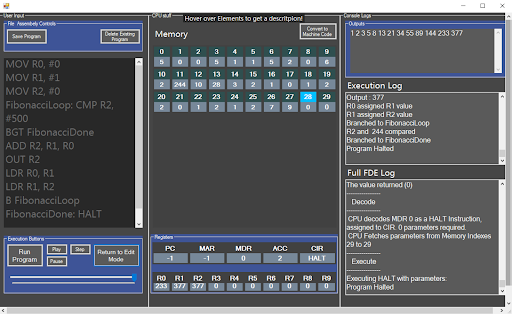

# Welcoke to CPU Visualised
This is a bespoke windows form application I created for Brentwood School to aid Education covering the following topics: 
> Assembly language
> 
> CPU Special Purpose Registers
> 
> OOP design

This project doubled as my Non Examined Assessment during A-Levels.

Note : this project is no longer maintained. 

## Image of Program
An image of the program can be seen below. In this image, the assembly is running the fibonnacci coded in my assembly.

When opened, the tutorial should run you through the program functionality

